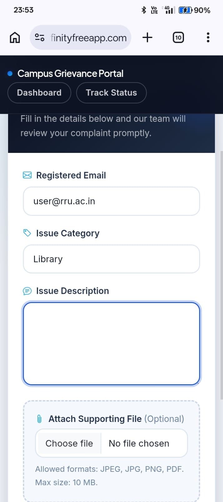

# ECHO - Campus Grievance Management System

ECHO is a secure web-based grievance management platform developed to improve transparency and efficiency in campus complaint handling.

Students can register, submit grievances, track complaint progress, upload supporting documents, and support public complaints through a voting mechanism. Administrators can review, prioritize, update, and resolve complaints through a dedicated management portal.

---

## NOTE
This repository contains Version 2 of the Campus Grievance Reporting System.
Previous version:
[Version 1 Repository](https://github.com/adityavijaymohanpandey-cloud/ECHO-campus-grievance-system.git)

## Features

### Student Portal

- User Registration
- Secure Login System
- Submit Complaints
- Complaint Tracking
- Public Complaint Feed
- Complaint Upvoting System
- File Attachment Uploads
- Responsive Dashboard

### Administrator Portal

- Secure Admin Authentication
- Complaint Management Dashboard
- View Submitted Complaints
- Update Complaint Status
- Delete Complaints
- Session-Based Access Control

### Complaint Categories

- Hostel
- Mess
- Department
- Library
- Infrastructure
- Other

---

## Security Features

- Password Hashing (bcrypt)
- CSRF Protection
- Security Headers
- Content Security Policy
- Rate Limiting
- Session Fixation Protection
- Secure File Upload Validation
- Structured Security Logging
- Input Validation & Sanitization

---

## Technology Stack

| Layer | Technology |
|---------|------------|
| Frontend | HTML5, CSS3, Bootstrap 5 |
| Backend | PHP |
| Database | MySQL |
| Server | Apache (XAMPP) |
| Authentication | PHP Sessions |
| Security | CSRF Tokens, CSP, Rate Limiting |

---

## Screenshots

### Submit Complaint



---

## Installation

### Clone Repository

```bash
git clone https://github.com/Jackden404/campus-grievance.git
```

### Configure Database

Create a MySQL database:

```sql
campus_grievance
```

Import the provided SQL file.

Copy:

```text
php/connect.example.php
```

to:

```text
php/connect.php
```

Update the database credentials.

---

## Running the Application

1. Start Apache and MySQL in XAMPP.
2. Place the project folder inside:

```text
C:/xampp/htdocs/
```

3. Open:

Open your browser and navigate to:

```text
http://localhost/<project-folder-name>
```

Example:

```text
http://localhost/ECHO-campus-grievance-management-system
```

---

## Version History

### Version 2.0

- Public complaint feed
- Community voting
- File attachments
- Security hardening
- Admin workflow improvements
- Session security
- Improved UI/UX

---

## Contributors

- Aditya (username - adityavijaymohanpandey-cloud)
- Abhishek (username - Jackden404)

---

## License

Developed for academic and educational purposes.
